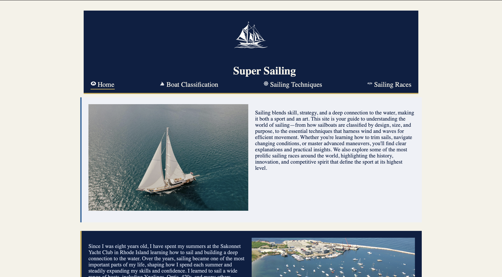

**Super Sailing **
A responsive, multi-page website designed to teach others about sailing while refining my HTML, CSS, and J.S. ability.
 

**About: **
This site serves to inform non-sailors more about the sport. The site includes aspects on racing techniques, specific sailing races and general boat knowledge.

**Features**
* Responsive design to work on both mobile and desktop, responding to users screen width
* Multipage navigation menu, highlighting the current page and collapsing into a navigation button for mobile devices
* Image galleries incorporating modals to offer more information for users

**Built using:**
* HTML
* CSS
* JavaScript

